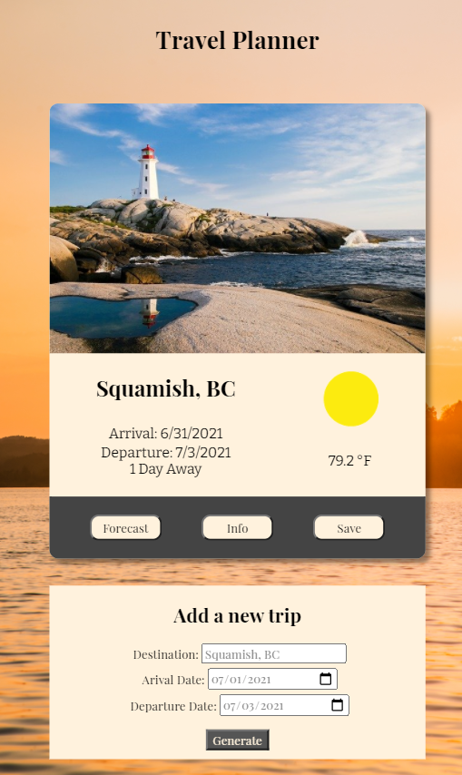
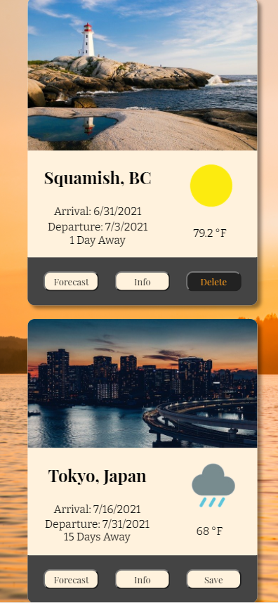
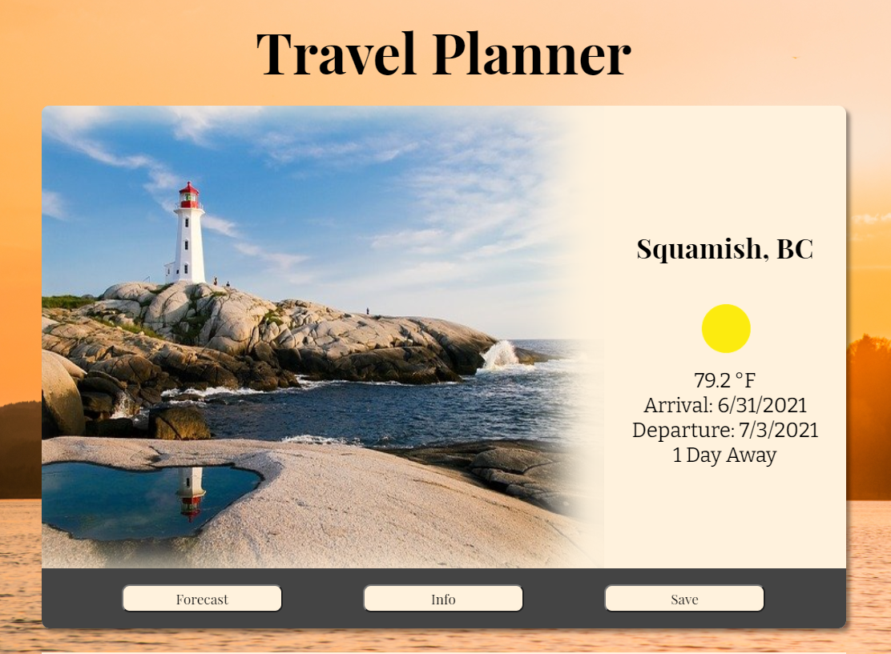
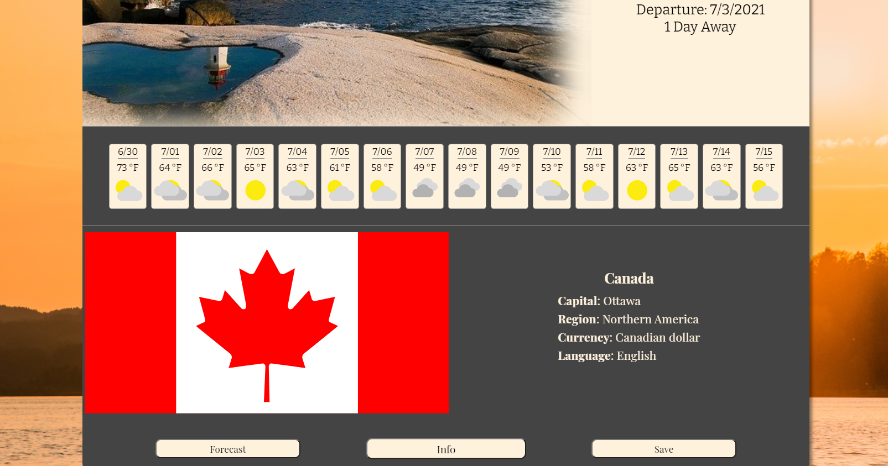

# Travel App

## Table of contents

* [Description](#Description)
* [Instructions](#Instructions)
* [Resources](#Resources)

## Description

### Summary

This application takes in a destination, an arrival date, a departure date, and builds an entry full of information regarding the trip. This entry shows the destination, the dates of the trip, the number of days away the trip is from the current day, and the current weather at the destination. If the user wants to see the extended forecast for their destination, they can click the 'forecast' button to see the projected forecast for the next 16 days. Likewise, the user can learn more about the country they intend to visit by clicking the 'info' button. These individual trips can also be saved and removed from the local storage by clicking the 'save' and 'delete' buttons. These trips have unique and seemless displays for all screen sizes, but is best viewed from screens at least 200px wide.

This project is meant to demonstrate the skills learned from Udacity's FEND nanodegree program. These skills include working with:

* HTML
* CSS/SCSS
* JavaScript (including asynchronous JavaScript)
* The DOM
* Webpack
* Node.js/Express
* External APIs
* Service workers
* Unit testing with Jest

### Working Parts

Once a user enters information and clicks 'Generate', the input information is tested to make sure it includes a valid destination and arrival/departure dates. If the information passes, it is sent to the Express server via a post request. The Express server uses asynchronous JavaScript to first fetch latitude and longitude coordiinates from the Geonames API. These coordinates and other data regarding the location of the destination, such as the city, state, and country, are used to fetch weather data from Weatherbit, images from Pixabay, and country information from REST countries. Specific bits of information from each external API are then combined into a single object and sent back to the client. A new trip entry is then built using that data. The user also has the option to save the trip entry. If a trip is saved, the necessary information contained in the newly constructed HTML elements is extracted and saved in an object in local storage. When the user refreshes their browser, the saved trip is reconstructed, but instead of loading old weather forecasts, the weather is updated to current forecasts using another post request to the server that once again gets data from Weatherbit. The user also has the option to delete entries which both removes the trip's date from local storage and removes the trip div from the DOM.

### Screen Captures






### Challenges

This project was challenging from a number of angles. First, it was a challenge to get all the information from four external APIs in one click using asynchronous JavaScript. The solution was to make heavy (and logical) use of the 'await' command. Next, it was a challenge to piece all of the information together in a way that looked good. I spent quite some time tinkering with CSS Grid and Flexbox to adequately style the page. Then, saving the trip information was quite challenging because I needed to save functionality, not just the HTML of the trip. This required the trip cards to be reconstructed instead of fully saved in the local storage. I also wanted to update the weather forecast each time the saved trip was reconstructed, so I needed to make an additional fetch request to the weatherbit API. Finally, it was a challenge to load in all weather icons. I needed to use the file-loader and a function to import all icons rather than importing the icons individually to the entry point.

## Instructions

### Install Dependencies

First, fork and clone this repository from [Github](https://github.com/LanceStasinski/FEND-05-TravelApp). From there, navigate to the directory and install dependencies via the following code:

```bash

cd <directory>
npm install

```

### API Keys

Second, you'll need API keys for Geonames, Weatherbit, and Pixabay. Follow the links in the [Resources](#Resources) section to sign up for free. Next, add a `.env` file to the root of the directory containing the following text using your new keys.

```bash

GEO_USERNAME = <your Geonames username>
WEATHER_KEY = <your Weatherbit api key>
PIXABAY_KEY = <your Pixabay api key>

```

### Start the app

#### Start the server

Use `npm run start` to start the Express server.

#### Production Mode

Use these commands if you want to view the project in production mode (recommended):

```bash

npm run build-prod

```

Then, navigate to [http://localhost:3030](http://localhost:3030) in your browser.

#### Developer Mode

Use the following command if you want to run this app in the webpack dev server:

```bash

npm run build-dev

```

## Resources

* [Weatherbit](https://www.weatherbit.io/api)
* [Geonames](https://www.geonames.org/export/web-services.html)
* [Pixabay](https://pixabay.com/api/docs/)
* [RESTCountries](https://restcountries.eu/#api-endpoints-name)
* [GitHub](https://github.com/gatsbyjs/gatsby/issues/3663) - import all images from a folder
* [geeksforgeeks](https://www.geeksforgeeks.org/how-to-calculate-the-number-of-days-between-two-dates-in-javascript/) -  determine number of days between two dates function.
* [dev](https://dev.to/bgord/simplify-repetitive-jest-test-cases-with-test-each-310m) - test.each procedure.
